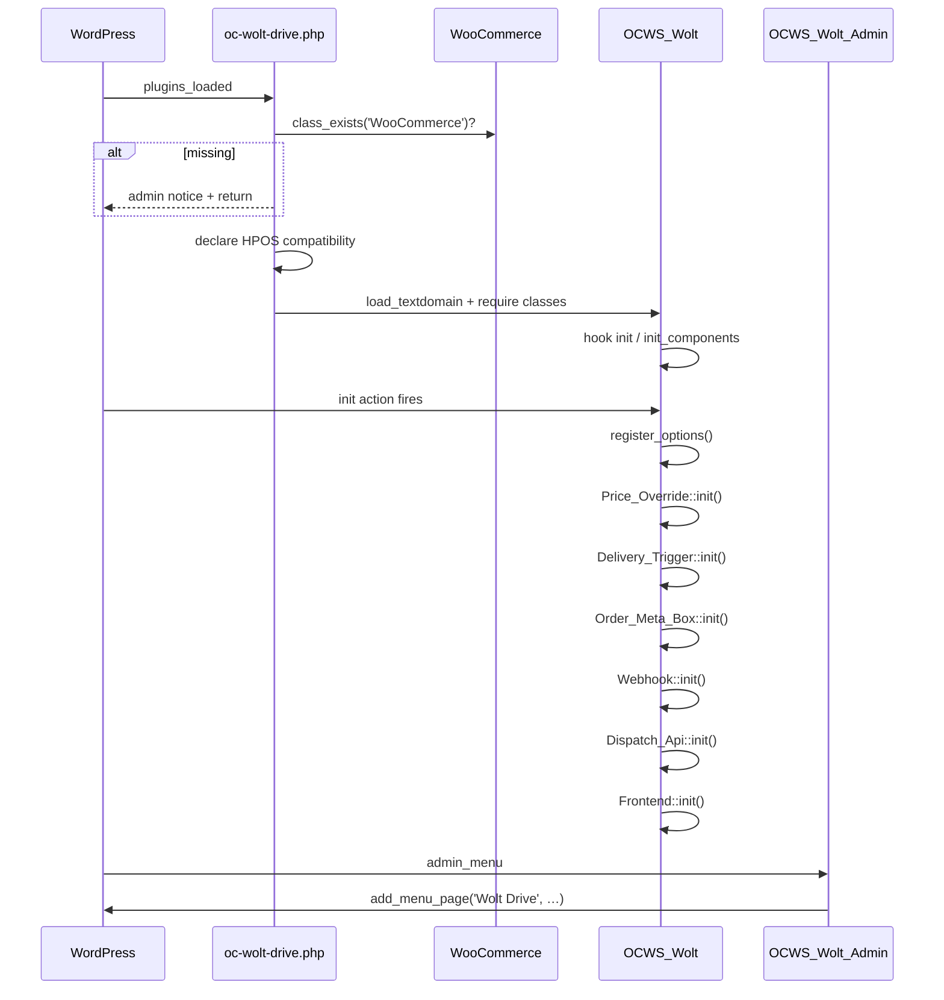
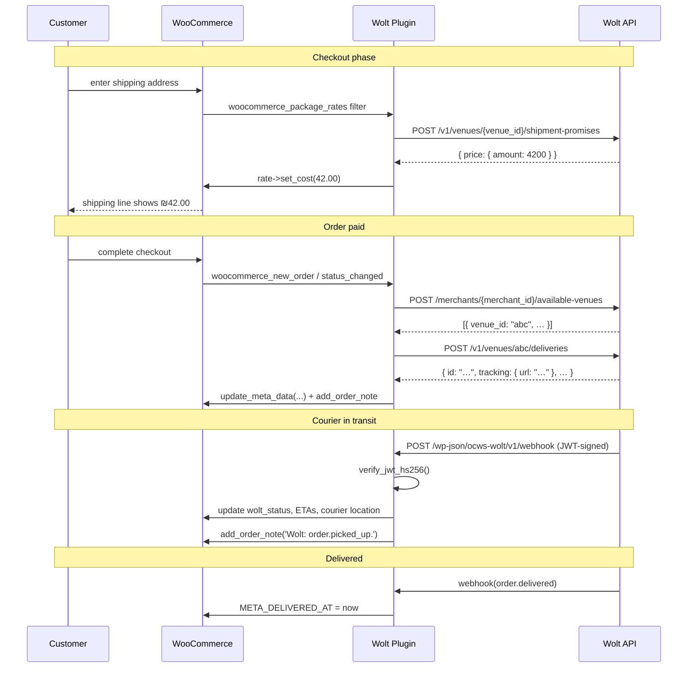

# Architecture

This is the reference for how the plugin is laid out internally — file
map, class responsibilities, and runtime flow diagrams.

If you're looking for the *why* behind these choices, see
[Design decisions](../explanation/design-decisions.md).

---

## File tree

```
shipping-wolt-plugin/
├── oc-wolt-drive.php              ← plugin header, bootstrap, env guards,
│                                    HPOS compat declaration, ocws_wolt_*
│                                    helper functions
├── uninstall.php                  ← deletes every ocws_wolt_* option
├── readme.txt                     ← WP-style plugin readme
├── CLAUDE.md                      ← briefing for AI assistant continuity
├── LICENSE.txt                    ← GPL-2.0+
├── .gitignore                     ← .claude/, .idea/, .DS_Store, …
│
├── assets/
│   ├── css/admin.css              ← Wolt-style design tokens + admin UI
│   ├── css/frontend.css           ← Customer thank-you tracking card
│   └── js/admin.js                ← AJAX for test/generate/cancel/register
│
├── bin/
│   ├── make-pot.sh                ← Regenerate POT + msgmerge .po files
│   └── make-pot.bat               ← Windows companion
│
├── languages/
│   ├── oc-wolt-drive.pot          ← Master translation template
│   ├── oc-wolt-drive-he_IL.po     ← Hebrew source (full)
│   └── oc-wolt-drive-he_IL.mo     ← Compiled binary WP loads
│
├── docs/                          ← (this directory)
│
└── includes/
    ├── class-ocws-wolt.php              ← Runtime loader (init() chain)
    ├── class-ocws-wolt-admin.php        ← Standalone 4-tab admin page
    ├── class-ocws-wolt-frontend.php     ← Customer tracking card + email row
    ├── class-ocws-wolt-settings.php     ← Options registry + sanitisers
    ├── class-ocws-wolt-api.php          ← All outbound HTTP to Wolt
    ├── class-ocws-wolt-price-override.php  ← woocommerce_package_rates filter
    ├── class-ocws-wolt-delivery-trigger.php ← Order → Wolt dispatch flow
    ├── class-ocws-wolt-order-meta-box.php   ← Per-order Wolt info in admin
    ├── class-ocws-wolt-webhook.php          ← Inbound Wolt event endpoint
    └── class-ocws-wolt-dispatch-api.php     ← Public REST endpoint for external trigger
```

Every class is wrapped in `if ( ! class_exists( … ) ) : … endif;` so a
stale legacy copy in another plugin folder cannot trigger a "Cannot
declare class" fatal — the duplicate is silently skipped and an
`error_log` line identifies the source.

---

## Class responsibilities

| Class | Hooks into | Responsibility |
|---|---|---|
| `OCWS_Wolt` | `plugins_loaded` → loads everything | Loader / `init()` chain. The only class the bootstrap calls. |
| `OCWS_Wolt_Settings` | `init` (`register_options`) | Defines option keys, sanitisers, defaults. Pure data layer — no UI. Provides getters used everywhere. |
| `OCWS_Wolt_Admin` | `admin_menu`, `admin_enqueue_scripts`, `wp_ajax_*` | Top-level "Wolt Drive" menu, 4-tab admin page, all admin AJAX endpoints. |
| `OCWS_Wolt_Frontend` | `woocommerce_order_details_after_order_table`, `woocommerce_email_order_meta_fields`, `wp_enqueue_scripts` | Customer-facing surfaces only — tracking card on thank-you + view-order, tracking row in WC emails. |
| `OCWS_Wolt_Api` | None (called by other classes) | Stateless HTTP client. One static method per Wolt endpoint. |
| `OCWS_Wolt_Price_Override` | `woocommerce_package_rates` (priority 20) | Overrides the host shipping method's cost with Wolt's live quote at checkout. |
| `OCWS_Wolt_Delivery_Trigger` | `woocommerce_order_status_changed`, `woocommerce_new_order` | Builds the create-delivery payload and persists Wolt's response to order meta. |
| `OCWS_Wolt_Order_Meta_Box` | `add_meta_boxes`, `admin_post_*` | Per-order Wolt summary panel + manual "Create Wolt delivery now" button. |
| `OCWS_Wolt_Webhook` | `rest_api_init` | Receives inbound JWT-signed events from Wolt. |
| `OCWS_Wolt_Dispatch_Api` | `rest_api_init` | Public REST endpoint external systems can call to trigger dispatch. |

---

## Bootstrap flow



---

## Runtime flow — order lifecycle



---

## Three Wolt API calls, three different triggers

| Call | When | Triggered from | Wolt endpoint |
|---|---|---|---|
| **shipment-promises** | Every address change in checkout | `OCWS_Wolt_Price_Override::filter_package_rates()` | `POST /v1/venues/{venue_id}/shipment-promises` |
| **available-venues** | Just before creating the delivery | `OCWS_Wolt_Delivery_Trigger::resolve_venue_for_payload()` | `POST /merchants/{merchant_id}/available-venues` |
| **deliveries** | Order paid (auto) or manual button | `OCWS_Wolt_Delivery_Trigger::create_for_order()` | `POST /v1/venues/{venue_id}/deliveries` |
| **cancel** | Admin Cancel button (and only while cancellable) | `OCWS_Wolt_Admin::ajax_cancel_delivery()` | `PATCH /order/{wolt_order_reference_id}/status/cancel` |
| **webhook CRUD** | Admin Register / Re-register / Unregister | `OCWS_Wolt_Admin::ajax_register_webhook()` | `POST/GET/DELETE /v1/merchants/{merchant_id}/webhooks[/{id}]` |
| **delivery-areas** | Settings tab "Test connection" button | `OCWS_Wolt_Admin::ajax_test_connection()` | `GET /merchants/{merchant_id}/delivery-areas` |

For the request / response shape of each, see
[Wolt API mapping](wolt-api-mapping.md).

---

## REST endpoints we expose

The plugin exposes two endpoints under the `ocws-wolt/v1` REST namespace:

| Path | Class | Purpose | Auth |
|---|---|---|---|
| `POST /ocws-wolt/v1/webhook` | `OCWS_Wolt_Webhook` | Receive JWT-signed events from Wolt | HS256 JWT signed with the configured webhook secret |
| `POST /ocws-wolt/v1/dispatch` | `OCWS_Wolt_Dispatch_Api` | Trigger dispatch from external systems | Bearer token from settings |

See [Webhook events](webhook-events.md) and [Dispatch API guide](../how-to/dispatch-api.md).

---

## Coexistence with the OC Advanced Shipping plugin

```
┌──────────────────────────────────────────────────────────────────┐
│   OC Advanced Shipping (host)             OC Wolt Drive          │
│   ─────────────────────────────           ──────────────         │
│   - Registers shipping methods            - Reads the rate ID    │
│   - Owns checkout slot picker             - Reads slot meta      │
│   - Owns Google autocomplete →            - Reads OC custom      │
│     billing_street, billing_city_name…       address fields      │
│   - Owns shipping polygons / groups       - Looks up group_id    │
│                                             via OC helpers       │
│                                                                  │
│       ▲                                              │           │
│       │ contract: prefix + meta keys                 │           │
│       └──────────────────────────────────────────────┘           │
└──────────────────────────────────────────────────────────────────┘
```

The contract between the two plugins is a handful of stable strings,
not a class API:

- Shipping method ID **starts with** `oc_woo_advanced_shipping_method`
  (configurable in our Advanced settings).
- Order meta keys: `_shipping_street`, `_shipping_house_num`,
  `_shipping_city_name`, `_shipping_floor`, `_shipping_apartment`,
  `_shipping_enter_code`, `_shipping_phone`,
  `_shipping_address_coords`, `ocws_shipping_info_date`,
  `ocws_shipping_info_slot_start`, `ocws_leave_at_the_door`.
- Group resolution: helper functions `ocws_get_group_id_by_city()` and
  the `oc_woo_shipping_locations` table (Wolt plugin tolerates either
  being missing).

See [Host plugin contract](../explanation/host-plugin-contract.md).

---

## See also

- [Settings reference](settings.md) — every option, its format, the
  class method that owns it.
- [Order meta reference](order-meta.md) — every per-order meta key.
- [Wolt API mapping](wolt-api-mapping.md) — what we send to Wolt and
  what we read back.
- [Design decisions](../explanation/design-decisions.md) — *why* the
  architecture is shaped this way.
